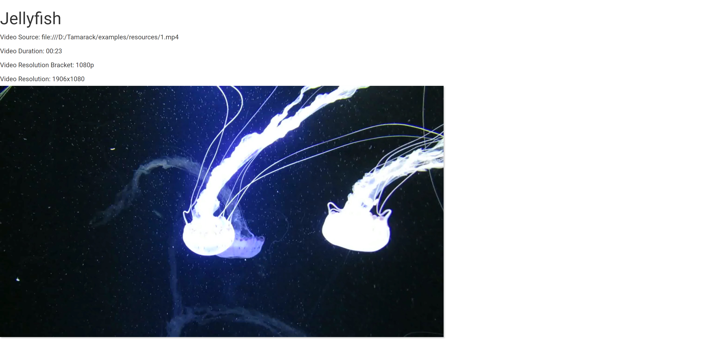
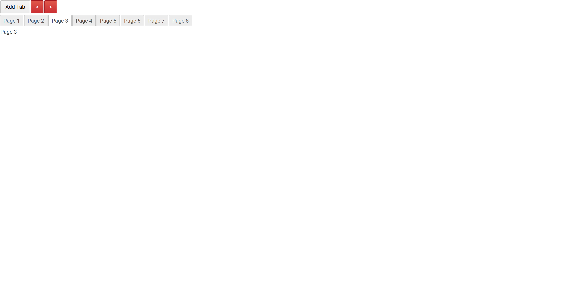

# Tamarack
An easy to use JavaScript library that can create, modify, and style HTML through ECMAScript 6 classes. It is designed to be used in Electron apps, but works well for browser apps as well.
 
Architecture 
-------
Most of Tamarack is a collection of widgets that provide a wrapper around html elements, such as tkButton, which wraps around &lt;button&gt; or tkImage, which wraps around &lt;img&gt;. All of these widgets inherit from tkWidget, which provides them with basic functionality such as making the element full-screen or adding the widget to another widget. In addition, there are also composite widgets, such as tkNotebook and tkDialog, that represent multiple html elements in one single class, cutting down the need for massive amounts of boilerplate code for simple tasks.

Examples
-------
**Add HTML5 video:**
```javascript
var doc = new tkDocument();
var video = new tkVideo();
video.source = "video_source.mp4";
doc.add(video);
```


**Create a button that makes the video fullscreen when clicked:**
```javascript
var doc = new tkDocument();
var btnFullscreen = new tkButton();
btnFullscreen.text = "Go Fullscreen";				
btnFullscreen.element.onclick = () => video.makeFullScreen();
doc.add(btnFullscreen);
```

**Create a two page notebook:**
```javascript
var doc = new tkDocument();
var notebook = new tkNotebook();

var page1 = new tkNotebookPage("Page 1", "page1");
page1.addContent(say("Hello"));

var page2 = new tkNotebookPage("Page 2", "page2");
page2.addContent(say("World!"));

notebook.addPages(page1,page2);
doc.add(notebook);
```


**Show a yes/no dialog:**
```javascript
var dlgMessage = new tkDialog();

dlgMessage.choices = [tkDialogResult.YES, tkDialogResult.NO];
dlgMessage.title = "I was just wondering...";
dlgMessage.addContent(say("Do you like this demo?"));

dlgMessage.show((dialogResult) => {
    if(dialogResult == tkDialogResult.YES)
        alert("Thanks!");
});
```


**Set the background from a color dialog:**
```javascript
var doc = new tkDocument();
var dlgColor = new tkColorDialog();

dlgColor.show((dialogResult) => {
    if (dialogResult == tkDialogResult.OK)
        doc.setBackgroundColor(dlgColor.color.getHslaCss());
});
```

